<authentication_analysis>
### 1. Authentication Flows

Based on the provided documents (`prd.md`, `auth-spec.md`), two main flows have been identified:

1.  **New user registration:** The user creates an account by providing a username, password, and PIN code. After successful registration, they are automatically logged into the system.
2.  **Existing user login:** The user authenticates using their username and password to gain access to the application's protected resources.

### 2. Main Actors and Their Interactions

*   **Browser (User):** Initiates actions by interacting with the interface (filling out forms, clicking buttons).
*   **Frontend (Astro/React):** Renders the user interface, manages form state, performs client-side validation, and communicates with the backend.
*   **Backend (Rust API):** Receives requests from the frontend, performs server-side validation, processes business logic (password hashing, permission checking), communicates with the database, and generates JWT tokens.
*   **Database (PostgreSQL):** Stores user data, including hashed passwords.

### 3. Token Verification and Refresh Processes

*   **Token Verification:** The backend uses middleware that, with every request to a protected resource, checks the presence and validity of the JWT token (sent in an `httpOnly` cookie). The signature and expiration date of the token are verified.
*   **Token Refresh:** A token refresh mechanism (refresh token) was not included in the MVP scope. After the access token expires (after 1 hour), the user must log in again.

### 4. Description of Authentication Steps

**Registration:**
1.  The user fills out the registration form (login, password, PIN).
2.  The frontend sends the data to the `POST /users` endpoint on the backend.
3.  The backend validates the data, checks if the user does not exist, hashes the password, and saves the new user in the database.
4.  After successful registration, the frontend automatically sends the login data to the `POST /auth/login` endpoint.
5.  The backend verifies the data, generates a JWT token, and places it in an `httpOnly` cookie in the response.
6.  The frontend redirects the user to the `/dashboard` page.

**Login:**
1.  The user fills out the login form (login, password).
2.  The frontend sends the data to the `POST /auth/login` endpoint.
3.  The backend verifies the data, generates a JWT token, and places it in an `httpOnly` cookie.
4.  The frontend reloads the page, and the Astro middleware redirects the user to the appropriate page (`/dashboard` or `/admin/dashboard`) based on the role in the token.

**Access to Protected Resources:**
1.  The browser sends a request to a protected page (e.g., `/dashboard`).
2.  Astro middleware (frontend) checks for the presence of the token cookie. If it's not there, it redirects to `/login`.
3.  The frontend (e.g., a React component) sends a request to the API (e.g., `GET /certificates`).
4.  Middleware on the backend verifies the JWT token. If it is invalid, it returns a `401 Unauthorized` error.
5.  If the token is valid, the backend processes the request and returns the data.

```mermaid
sequenceDiagram
    autonumber

    participant Browser
    participant Frontend (Astro/React)
    participant Backend (Rust API)
    participant Database (PostgreSQL)

    Note over Browser, Database (PostgreSQL): Flow: New user registration
    Browser->>Frontend (Astro/React): Fills out form (login, password, PIN)
    activate Frontend (Astro/React)
    Frontend (Astro/React)->>Frontend (Astro/React): Client-side validation
    Frontend (Astro/React)->>Backend (Rust API): POST /users (login, hasło, PIN)
    deactivate Frontend (Astro/React)

    activate Backend (Rust API)
    Backend (Rust API)->>Backend (Rust API): Server-side validation (min. 8 characters)
    Backend (Rust API)->>Database (PostgreSQL): Check if 'username' exists
    activate Database (PostgreSQL)
    Database (PostgreSQL)-->>Backend (Rust API): User does not exist
    deactivate Database (PostgreSQL)

    Backend (Rust API)->>Backend (Rust API): Hash password and PIN (e.g., argon2)
    Backend (Rust API)->>Database (PostgreSQL): Save user (username, hash, pin_hash)
    activate Database (PostgreSQL)
    Database (PostgreSQL)-->>Backend (Rust API): User saved
    deactivate Database (PostgreSQL)
    Backend (Rust API)-->>Frontend (Astro/React): 201 Created
    deactivate Backend (Rust API)

    Note over Frontend (Astro/React),Database (PostgreSQL): Automatic login after registration
    activate Frontend (Astro/React)
    Frontend (Astro/React)->>Backend (Rust API): POST /auth/login (login, password)
    deactivate Frontend (Astro/React)

    activate Backend (Rust API)
    Backend (Rust API)->>Database (PostgreSQL): Find user and get hash
    activate Database (PostgreSQL)
    Database (PostgreSQL)-->>Backend (Rust API): Returns password hash
    deactivate Database (PostgreSQL)

    Backend (Rust API)->>Backend (Rust API): Verify password
    Backend (Rust API)->>Backend (Rust API): Generate JWT token (with role and exp)
    Backend (Rust API)-->>Frontend (Astro/React): 200 OK (with httpOnly cookie)
    deactivate Backend (Rust API)

    activate Frontend (Astro/React)
    Frontend (Astro/React)->>Browser: Redirect to /dashboard
    deactivate Frontend (Astro/React)

    Note over Browser, Database (PostgreSQL): Flow: Existing user login
    Browser->>Frontend (Astro/React): Fills out form (login, password)
    activate Frontend (Astro/React)
    Frontend (Astro/React)->>Backend (Rust API): POST /auth/login (login, password)
    deactivate Frontend (Astro/React)

    activate Backend (Rust API)
    Backend (Rust API)->>Database (PostgreSQL): Find user and get hash
    activate Database (PostgreSQL)
    Database (PostgreSQL)-->>Backend (Rust API): Returns password hash
    deactivate Database (PostgreSQL)

    alt Correct data
        Backend (Rust API)->>Backend (Rust API): Verify password
        Backend (Rust API)->>Backend (Rust API): Generate JWT token
        Backend (Rust API)-->>Frontend (Astro/React): 200 OK (with httpOnly cookie)
    else Incorrect data
        Backend (Rust API)-->>Frontend (Astro/React): 401 Unauthorized
    end
    deactivate Backend (Rust API)

    activate Frontend (Astro/React)
    alt Login successful
        Frontend (Astro/React)->>Browser: Reload page (GET /)
        Browser->>Frontend (Astro/React): GET / (with cookie)
        Note right of Frontend (Astro/React): Astro middleware verifies token and role
        Frontend (Astro/React)->>Browser: Redirect to /dashboard or /admin/dashboard
    else Login failed
        Frontend (Astro/React)->>Browser: Display error "Invalid login credentials"
    end
    deactivate Frontend (Astro/React)

    Note over Browser, Database (PostgreSQL): Flow: Access to protected resources
    Browser->>Frontend (Astro/React): GET /dashboard (with httpOnly cookie)
    activate Frontend (Astro/React)
    Note right of Frontend (Astro/React): Astro middleware verifies JWT token.<br/>If not present, redirects to /login.
    Frontend (Astro/React)-->>Browser: Returns HTML page (/dashboard)
    deactivate Frontend (Astro/React)

    Note over Browser, Frontend (Astro/React): React component on /dashboard page<br/>sends a request to the API for data.
    activate Frontend (Astro/React)
    Frontend (Astro/React)->>Backend (Rust API): GET /certificates
    deactivate Frontend (Astro/React)

    activate Backend (Rust API)
    Backend (Rust API)->>Backend (Rust API): Middleware verifies JWT token
    Backend (Rust API)->>Database (PostgreSQL): Get data for the user from the token
    activate Database (PostgreSQL)
    Database (PostgreSQL)-->>Backend (Rust API): Returns data
    deactivate Database (PostgreSQL)
    Backend (Rust API)-->>Frontend (Astro/React): 200 OK (with data)
    deactivate Backend (Rust API)

    activate Frontend (Astro/React)
    Frontend (Astro/React)->>Browser: Display fetched data
    deactivate Frontend (Astro/React)
```

</authentication_analysis>

<mermaid_diagram>

</mermaid_diagram>